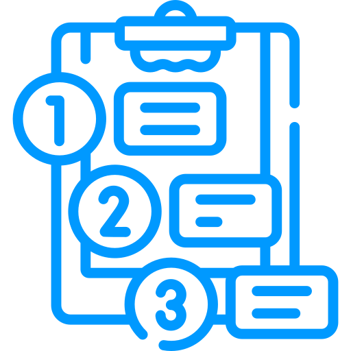

<p align="center">

</p>
<h1 align="center">
    toDo-List
</h1>

<p align="center"> 
📖 Estudo dirigido aos frameworks Angular
</p>

<p align="center" style="margin-bottom:50px;">
 <a href="#🏁Sobre">Sobre</a> •
 <a href="#🧰Instalação">Instalacao</a> • 
 <a href="#✅tecnologias">Tecnologias</a> • 
 <a href="#📄como-usar">Como usar</a> •
 <a href="#features">Features</a> 
</p>

<p align="center">

</p>


### 🏁Sobre

toDo-List ou lista de afazeres é um sistema para registros onde o usuário cadastra suas atividades diárias como em uma planner físico mas com a vantagem de levar esse a qualquer lugar e assim nunca mais esquecer uma atividade!

O aplicativo é bem simples pois o principal intuito foi entender alguns conceitos, funcionamento e arquitetura do Angular. A forma em que o app persiste os dados é através do Local Strong salvando as novas atividades em formato de uma string json.

#### Conceitos 
* Módulos
* Template
* Metadate
* Componente
* Vinculação de propriendades e ligação de elementos
* Diretivas
* Serviços


### 🧰Instalação

#### 🚧 Alguns pré-requisitos 🚧
É necessário que você tenha o Node em uma versão > 10

#### 🚀 Go 🚀
Utilize esse comando para clonar o reposiótio:
```GIT
git clone https://github.com/gdk46/toDoList-angular.git
```
ou baixe clicando [aqui](x-github-client://openRepo/https://github.com/gdk46/toDoList-angular).

Acesse ao diretório e digite os comandos para baixar as dependêcias:
```
Acessando o diretório:
cd toDoList-angular

Baixar as dependêcias no Windows, Linux ou Mac:
npm install
```

### ✅Tecnologias

* [Angular](https://github.com/angular/angular-cli) version: 8.3.29
* [NPM](https://www.npmjs.com/) version: 6.14.11
* [Node](https://nodejs.org/pt-br/) version: 14.15.5
* HTLM5
* CSS3


### 📄Como usar

Execute `ng serve -o` para um habilitar servidor de desenvolvimento. Logo em seguida irar abrir uma aba em seu navegador. O aplicativo será recarregado automaticamente se você alterar qualquer um dos arquivos de origem.

Agora é só registrar e seguir com suas metas!!!

### Features

- [x] Cadastro de Tarefa
- [x] Refazer de Tarefa
- [x] exclusão de Tarefa
- [x] Listagem de Tarefa
